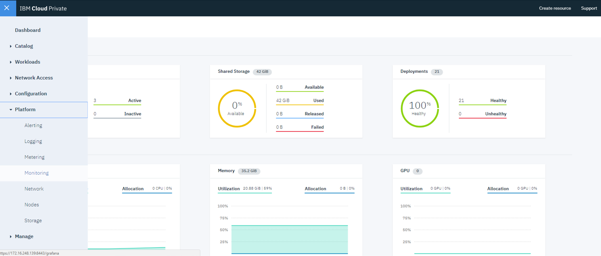

# Monitoring and Alerting
The approach to Monitoring and Alerting on events of importance is one of the most important considerations for an enterprise. It is often overlooked by organizations, and, at times haphazardly implemented at the last minute, in many cases, it does not provide the proper coverage of an application and it components.

One of the cluster supported by MCM is the ICP cluster. Let us look at how IBM Cloud Private deployment provides the ability to monitor the ICP components. As described below and at the links included herein, this capability should be leveraged and integrated with your enterprise event management and application performance management.

There is a high level view of the ICP Performance available on the on the main ICP Dashboard. KPIs such as  Active/Inactive Nodes, deployment health, CPU and Memory are displayed. This is a view only interface, meaning there are no integrations available.

When ICP is deployed, the Open Source monitoring tool, Prometheus, and visualization software Grafana, are installed. This combination provides immediate monitoring of the ICP deployment infrastructure components. The Grafana Dashboards that are supplied provide various views of the time-series data collected by Prometheus.

Verify Prometheus and Grafana are properly working by launching Grafana from the ICP Dashboard:
From the Main Dashboard select Platform/Monitoring. The Grafana URL is also generally available using a the proper URL for your deployment: _https://IPAddr:8443/Grafana_
Open one of the available dashboards such as the IBM Provided ICP 2.1 Performance Dashboard and observe the performance of the ICP installation.  Here you'll have a view of KPIs, Container,Pod and Worker node performance:

See the  CSMO Expert Lab [ICP github](https://github.com/ibm-cloud-architecture/CSMO-ICP)

## Prometheus
More than likely there will be more than one ICP deployment in your enterprise, and, as such, there may be a need to federate the Prometheus instances to gain centralized observability of all ICP deployments. For detailed information on Prometheus Federation, start [here](https://github.com/ibm-cloud-architecture/CSMO-ICP/tree/master/prometheus/federation)

## External Monitoring APM
ICP is usually installed into a Virtual Machine environment. You need to ensure the Host VMs for ICP also are monitored by your enterprise monitoring solution, such as IBM APM, New Relic, Prometheus, etc.

The deployed applications also require the appropriate level of monitoring. At a minimum, key URLs and APIs should be monitored via the APM tool used in your enterprise. You should also consider recording transactions and leveraging the playback for monitoring of response time and availability.

## Grafana
See our Grafana examples at the CSMO-ICP github page: [ICP Dashboards](https://github.com/ibm-cloud-architecture/CSMO-ICP/tree/master/grafana) and [APM DashBaords](https://github.com/ibm-cloud-architecture/CSMO-ICP/tree/master/APM)

## Alerting
It is desirable to have the ICP deployments send events of importance to your organization's incident-management solution.
Prometheus has the ability to forward events of your choosing, using AlertManger component. Emal, API, webhook etc. For example alerts can be sent directly to Pager Duty, NOI and Slack, among others. From a CSMO perspective, ICP alerts should be routed to the appropriate personnel, using an Incident Management tool such as  IBM Netcool Operations Insight, Cloud Event Manager or Service Now.

Trust but verify! Run some test alerts through your Incident Management pipeline to ensure that notifications are being delivered as expected.
