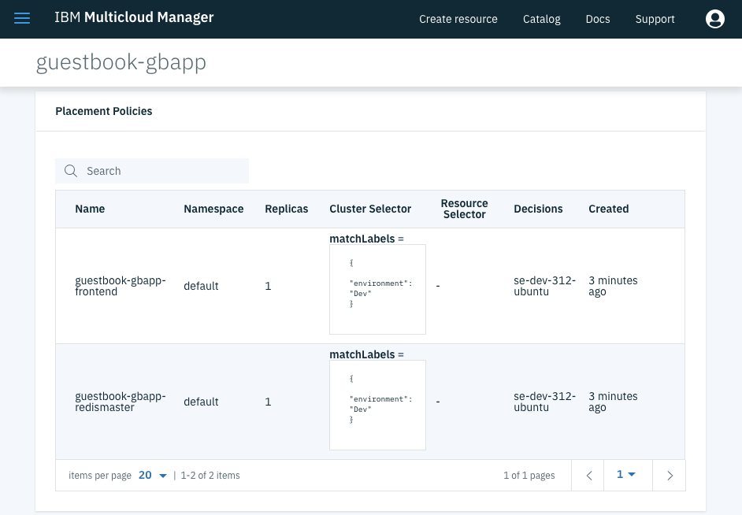

# Creating and Deploying MCM Applications
**Author:** Fabio Gomez (fabiogomez@us.ibm.com)

In this document, we will go over the process of creating and deploying an MCM Application on multiple clusters using the Helm CLI against the MCM Hub Cluster.

## Pre-Requisites
  * 2 x [IBM Cloud Private](https://www.ibm.com/support/knowledgecenter/en/SSBS6K_3.1.2/kc_welcome_containers.html) Clusters with MCM Installed.
    + I recommend you go through the [`Installing MCM`](quickstart.md#installing-mcm) section of the [Quick Start](quickstart.md) chapter.
  * [Kubectl](https://kubernetes.io/docs/user-guide/kubectl-overview/) (Kubernetes CLI)
    + Follow the instructions [here](https://kubernetes.io/docs/tasks/tools/install-kubectl/) to install it on your platform.
  * [ICP Helm](https://github.com/kubernetes/helm) (Kubernetes package manager)
    + Follow the instructions [here](https://www.ibm.com/support/knowledgecenter/en/SSBS6K_3.1.2/app_center/create_helm_cli.html) to install it on your platform.
  * [IBM Cloud Private CLI](https://www.ibm.com/support/knowledgecenter/en/SSBS6K_3.1.2/manage_cluster/install_cli.html)
    + Follow the instructions [here](https://www.ibm.com/support/knowledgecenter/en/SSBS6K_3.1.2/manage_cluster/install_cli.html) to install it on your platform.

## Creating Multicloud Manager Applications
As explained in the [`Core Multicloud Manager Resources to Learn`](quickstart.md#core-multicloud-manager-resources-to-learn) section of the [Quick Start](quickstart.md) chapter, an `Application` is a way to relate multiple workloads (Helm Charts) as a single unit. By implementing the custom MCM YAML resources, MCM can monitor your applications, automate their deployment to multiple clusters, and extract the topology of all its components, amongst other features. Though not immediately useful for developers, these capabilities makes the lives of operators easier by having a single place where they can deploy and monitor applications on multiple clusters.

With the MCM Hub Cluster dashboard you can deploy a regular Helm Chart to multiple IBM Cloud Private (ICP) clusters, but that's the only benefit you get out of the box. To fully leverage MCM's deployment automation, monitoring, topology and its other capabilities, you will have to create custom MCM YAML resources that get deployed with your charts. Luckily, no changes need to be made to the original Helm Charts or their application code.

### Guestbook Helm Charts Introduced
In this document, we are going to cover the basic `Application` concepts we learned in [`Core Multicloud Manager Resources to Learn`](quickstart.md#core-multicloud-manager-resources-to-learn), but we will be using the `Guestbook` MCM Application code as an example to deploy 3 separate charts (explained later) on multiple clusters.

The actual `Guestbook` application code comes from the Kubernetes Community, and it's located publicly on the [kubernetes/examples](https://github.com/kubernetes/examples/tree/master/guestbook) repository. The application is broken up in the following 3 services:


  * **Redis Master**: A Redis Master instance.
  * **Redis Slave**: A Redis Slave instance, which replicates the contents of the Redis Master.
  * **Frontend**: An Angular.js application that uses PHP script to communicate with Redis Master and Slave.
  	+ In the application, you can submit Guestbook names, which get persisted in Redos.
    + It sends new names to the Redis Master, which then get replicated to the Redis Slave.
    + It then retrieves the names from the Redis Slave and prints them on the screen.

The above 3 services were converted into the following 3 Helm Charts for the purpose of this demo. You can find the source code for the Helm Charts here:

  * **Redis Master**: [gbrm](https://github.com/ibm-cloud-architecture/kubernetes-multicloud-management/tree/v312/cookbook/docs/demos/guestbook/gbapp/gbrm).
  * **Redis Slave**: [gbrs](https://github.com/ibm-cloud-architecture/kubernetes-multicloud-management/tree/v312/cookbook/docs/demos/guestbook/gbapp/gbrs).
  * **Frontend**: [gbf](https://github.com/ibm-cloud-architecture/kubernetes-multicloud-management/tree/v312/cookbook/docs/demos/guestbook/gbapp/gbf).

Lastly, in order to deploy the above charts through MCM, we are also going to need a Helm chart that deploys all of the MCM resources. Those resources do the actual deployment, monitoring, and topology setup for the 3 Helm Charts mentioned above.

In the next sections, you are going to explore parts of the source code that make the `gbapp` Helm Chart (the chart with the MCM Resources) to understand the process of creating an `Multicloud Manager Application`.

**NOTE**: To checkout the entire source code of the `gbapp` Helm Chart, checkout the link below:

  * [cookbook/docs/demos/guestbook/gbapp](https://github.com/ibm-cloud-architecture/kubernetes-multicloud-management/tree/v312/cookbook/docs/demos/guestbook/gbapp)

### Application Resource
First things first, in order for MCM to recognize your workloads as an MCM application, you have to create an `Application` resource. The `Application` resource lets you specify criteria to associate Kubernetes resources to your application so that MCM can manage and monitor them. Let's look at the `gbapp` Application resource from the Helm Chart below:

```yaml
apiVersion: app.k8s.io/v1beta1
kind: Application
metadata:
  name: {{ template "guestbookapplication.fullname" . }}
  labels:
    app: {{ template "guestbookapplication.name" . }}
    chart: {{ .Chart.Name }}-{{ .Chart.Version | replace "+" "_" }}
    release: {{ .Release.Name }}
    heritage: {{ .Release.Service }}
    name: {{ template "guestbookapplication.fullname" . }}
spec:
  selector:
    matchExpressions:
    - key: app
      operator: In
      values:
      - gbapp
      - gbf
      - gbrm
      - gbrs
  componentKinds:
  - group: core
    kind: Pods
```

Where:

  * **apiVersion**: Contains the Community SIG API version for Applications.
  * **kind**: Specifies that this is an `Application` resource type.
  * **metadata**: Contains the resource name and some labels.
  * **spec.selector.matchExpressions**: Contains the selectors that MCM will use to associate other Kubernetes resources to the application.
  	+ In this case, we are associated all resources with `app` label that contains any of the values listed in `spec.selector.matchExpressions[0].values`, which in this case are the names of the charts themselves.
  	+ If you go to the source code of any of the Guestbook Helm Charts and explore its resources (deployments, services, etc) you will notice that they contain an `app` label that contains the name of the Helm chart.
  * **spec.selector.componentKinds**: Contains a list of the kinds of resources to be associated with the application.
    + In this case we are only associating components of kind `Pods`.
    + However, you can associate resources of type `Deployment`, `StatefulSet`, `Service`, etc.
    + You can assign whatever name you like to the `group` field.

Later on, when we deploy the `gbapp` Helm Chart, you will see for yourself how the Guestbook resources are associated with the `Application`.

### Deployable Resource
Now that we know how to create an `Application` that knows how to associate resources to itself, it's time to learn how an `Application` can deploy those resources for itself. The way to do that is by creating a `Deployable` object, where you can specify what Helm chart to deploy and what namespace to deploy the chart into once the `PlacementPolicy` (explained in later sections) decides what clusters to deploy the Helm Charts into. Let's look at the `gbapp-frontend` Deployable resource from the Helm Chart below:

```yaml
apiVersion: mcm.ibm.com/v1alpha1
kind: Deployable
metadata:
  name: {{ template "guestbookapplication.fullname" . }}-frontend
  labels:
    app: {{ template "guestbookapplication.name" . }}
    chart: {{ .Chart.Name }}-{{ .Chart.Version | replace "+" "_" }}
    release: {{ .Release.Name }}
    heritage: {{ .Release.Service }}
    name: {{ template "guestbookapplication.fullname" . }}-frontend
    servicekind: ApplicationService
spec:
  deployer:
    kind: helm
    helm:
      chartURL: {{ .Values.chartRepoURL }}/gbf-0.1.0.tgz
      namespace: {{ .Values.appInClusterNamespace }}
```

Where:

  * **apiVersion**: Contains the MCM API version for Deployables.
  * **kind**: Specifies that this is an `Deployable` resource type.
  * **metadata**: Contains the resource name and some labels.
  * **spec.deployer.kind**: Specifies that is is a deployer that will deploy a Helm chart.
  * **spec.deployer.helm.chartURL**: Specifies the URL with the Helm Chart location.
    + In this case the Chart location is on this document's GitHub Repository.
  * **spec.deployer.helm.namespace**: Specifies the cluster namespace to deploy the Helm chart to.

### Relationship Resource
The more `Deployable` objects you create for an `Application`, the harder it becomes to determine your application's topology, specially for newcomers in your team. MCM provides application topology features via [Weave Scope](https://www.weave.works/oss/scope/) out of the box. However, to explicitly specify dependencies between certain components (Deployment, Application, etc), you will need to create an `ApplicationRelationship` resource. Let's look at the `gbapp-frontend-app` ApplicationRelationship resource from the Helm Chart below:

```yaml
apiVersion: mcm.ibm.com/v1alpha1
kind: ApplicationRelationship
metadata:
  name: {{ template "guestbookapplication.fullname" . }}-app-frontend
  labels:
    app: {{ template "guestbookapplication.name" . }}
    chart: {{ .Chart.Name }}-{{ .Chart.Version | replace "+" "_" }}
    release: {{ .Release.Name }}
    heritage: {{ .Release.Service }}
spec:
  type: contains
  source:
    kind: Application
    name: {{ template "guestbookapplication.fullname" . }}
  destination:
    kind: Deployable
    name: {{ template "guestbookapplication.fullname" . }}-frontend
```

Where:

  * **apiVersion**: Contains the MCM API version for ApplicationRelationship.
  * **kind**: Specifies that this is an `ApplicationRelationship` resource type.
  * **metadata**: Contains the resource name and some labels.
  * **spec.source.kind**: specifies the type of Resource for the `source` object, which is `Application` in this case.
  * **spec.source.name**: specifies the name of the `source` object, which is the `guestbook-gbapp` Application release and chart name combined.
  * **spec.destination.kind**: specifies the type of Resource for the `destination` object, which is `Deployable` in this case.
  * **spec.destination.name**: specifies the name of the `destination` object, which is the name for the `gbabb-frontend` Deployable.

### Placement Policy Resource
Normally, to deploy an application to multiple clusters, you to run the following steps on each cluster:

  * Login to get the kubernetes context.
  * Run the `helm install` command.

This does not seem like a lot of work for 2 or 3 clusters. But the more clusters you have to work with, the more credentials you have to remember and manage. Also, if you are using CI/CD pipelines to deploy your workloads, the more clusters you have, the more pipelines you have to write and embed those credentials to, which can lead to human errors. If those credentials were to change, you would have to update those credentials wherever they are being used, which can get hard to track.

By leveraging MCM, access to your clusters is managed from a central location. MCM expands on this capability with `Placement Policies` by allowing you to deploy workloads through it by specifying cluster labels, which are much easier to remember and manage. By adopting MCM into your CI/CD pipelines, you only have to remember the credentials for the MCM Hub cluster. To deploy workloads to multiple clusters, you only have to provide the number of application replicas and the cluster labels that match the clusters that you would like to deploy them to.

Let's look at the `gbapp-frontend` PlacementPolicy resource from the Helm Chart below:

```yaml
apiVersion: mcm.ibm.com/v1alpha1
kind: PlacementPolicy
metadata:
  name: {{ template "guestbookapplication.fullname" . }}-frontend
  labels:
    app: {{ template "guestbookapplication.name" . }}
    chart: {{ .Chart.Name }}-{{ .Chart.Version | replace "+" "_" }}
    release: {{ .Release.Name }}
    heritage: {{ .Release.Service }}
    name: {{ template "guestbookapplication.fullname" . }}-frontend
    servicekind: CacheService
spec:
  clusterReplicas: {{ .Values.replicaCount }}
  clusterLabels:
    matchLabels:
{{ toYaml .Values.targetCluster.labelSelector.matchLabels | indent 6 }}
  resourceHint:
{{ toYaml .Values.targetCluster.resourceSelector | indent 4 }}
  compliances: {{ .Values.targetCluster.compliances }}
```

Where:

  * **apiVersion**: Contains the MCM API version for PlacementPolicy.
  * **kind**: Specifies that this is an `PlacementPolicy` resource type.
  * **metadata**: Contains the resource name and some labels.
  * **spec.clusterReplicas**: contains the number of replicas (application instances) to deploy.
  * **spec.clusterLabels.matchLabels**: Contains the list of labels and values that clusters must have for MCM to deploy applications to them.
  * **spec.resourceHint**: If more than one cluster matches the labels and values provided above, you can specify to MCM a resource specific criteria to select the clusters.
    + For example, you can ask MCM to select the clsuter with the most available CPU cores.
  * **spec.compliances**: Contains a list of `Compliances` (outside of the scope of this chapter) resources to attach this policy to.
    + To learn about `Compliance` resources, checkout the [MCM Compliance Manager Chapter](policy.md).

### Placement Binding Resource
Just like how a Kubernetes `Role` requires `RoleBinding` to attach it to a specific `ServiceAccount`, a `PlacementPolicy` requires another resource that binds its rules to specific resources. This MCM resources is the `PlacementBinding`, which can bind the `PlacementPolicy` rules to specific Deployables. Let's look at the `gbapp-frontend` PlacementPolicy resource from the Helm Chart below:

```yaml
apiVersion: mcm.ibm.com/v1alpha1
kind: PlacementBinding
metadata:
  name: {{ template "guestbookapplication.fullname" . }}-frontend
  labels:
    app: {{ template "guestbookapplication.name" . }}
    chart: {{ .Chart.Name }}-{{ .Chart.Version | replace "+" "_" }}
    release: {{ .Release.Name }}
    heritage: {{ .Release.Service }}
    name: {{ template "guestbookapplication.fullname" . }}-frontend
    servicekind: CacheService
placementRef:
  apiGroup: mcm.ibm.com
  kind: PlacementPolicy
  name: {{ template "guestbookapplication.fullname" . }}-frontend
subjects:
- apiGroup: mcm.ibm.com
  kind: Deployable
  name: {{ template "guestbookapplication.fullname" . }}-frontend
```

Where:

  * **apiVersion**: Contains the MCM API version for PlacementBinding.
  * **kind**: Specifies that this is an `PlacementBinding` resource type.
  * **metadata**: Contains the resource name and some labels.
  * **placementRef.name**: Specifies the `PlacementPolicy` name to bind.
  * **subjects[0].name**: Specifies the `Deployable` name to bind the `PlacementPolicy` to.

### MCM Application Helm Chart
The above YAML resources mostly cover supporting the `frontend` Helm Chart. To see how we put together an MCM Application Helm Chart that deploys all of the 3 Guestbook Helm Charts, checkout the source code at the link below:

  * [cookbook/docs/demos/guestbook/gbapp](https://github.com/ibm-cloud-architecture/kubernetes-multicloud-management/tree/v312/cookbook/docs/demos/guestbook/gbapp)

## Deployment MCM Application
Now that you are aware of how to create MCM Applications, it is time to deploy the `gbapp` MCM Application Helm Chart, which deploys the Guestbook Frontend ([gbf](https://github.com/ibm-cloud-architecture/kubernetes-multicloud-management/tree/v312/cookbook/docs/demos/guestbook/gbapp/gbf)), Redis Master ([gbrm](https://github.com/ibm-cloud-architecture/kubernetes-multicloud-management/tree/v312/cookbook/docs/demos/guestbook/gbapp/gbrm)), and Redis Slave ([gbrs](https://github.com/ibm-cloud-architecture/kubernetes-multicloud-management/tree/v312/cookbook/docs/demos/guestbook/gbapp/gbrs)) charts.

Before you start with the examples, you will need to clone the code and log into the MCM Hub Cluster with the commands below:

```bash
# Clone the Repository
git clone https://github.com/ibm-cloud-architecture/kubernetes-multicloud-management.git
```

Also, open a new browser tab and go to the `Applications` page on the MCM Dashboard, as shown below:


You should then be greeted by an empty Applications page, which we will be populating later:


Now you are ready to start deploying the MCM Application!

### 0. Create Image Policies on Both Clusters
Since ICP version 3.1, you are required to create `Image Policies` that allow you to pull Docker images from specific Docker registries (`gcr.io` in our case). To do so, let's run the following commands on `EACH ICP CLUSTER`:
```bash
# Login to the ICP Cluster
cloudctl login -a https://ICP_MASTER_IP:8443 -n default --skip-ssl-validation

# Go to Helm Charts directory
cd cookbook/docs/demos/guestbook

# Create the Image Policy in the ICP Cluster
kubectl apply -f cookbook/docs/demos/guestbook/guestbook-cluster-image-policy.yaml
```

Don't forget to run the above commands on `EACH ICP Cluster` so that there are no issues when deploying the `gbapp` application.

### 1. Deploy to Dev Cluster
The process of deploying an MCM Application is the same as deploying a Helm Chart. To deploy the `gbapp` MCM Application Helm chart, run the commands below:

```bash
# Log into MCM HUB Cluster
cloudctl login -a https://HUB_CLUSTER_MASTER_IP:8443 -n default --skip-ssl-validation

# If not already there, go to the Helm Charts directory
cd cookbook/docs/demos/guestbook

# Deploy MCM Application Helm Chart
helm upgrade --install guestbook --set replicaCount=1 --set targetCluster.labelSelector.matchLabels.environment=Dev ./gbapp --tls
```

Where:

  * **replicaCount**: is a field that indicates the number of application instances we are deploying, which is 1.
  * **targetCluster.labelSelector.matchLabels.environment**: means we are using the `environment` field with a value of `Dev`, which tells the MCM Controller to should find a cluster that has that value for that field.
    + Checkout the [cookbook/docs/demos/guestbook/gbapp/values.yaml](https://github.com/ibm-cloud-architecture/kubernetes-multicloud-management/tree/v312/cookbook/docs/demos/guestbook/gbapp/values.yaml#L7) to learn the different fields we can use as cluster selectors.

Assuming that everything went well, you should now see the `guestbook-gbapp` MCM Application show up in the `Applications` page as shown below:


The above is all it takes to deploy an MCM Application. To deploy to multiple clusters (done in later sections) all you have to do is change the fields, values, and number of replicas in the `helm upgrade` command and MCM takes care of the rest.

Before exploring the multiple cluster scenario, let's first get familiar with examining MCM Application details on the `Applications` page.

### 2. Exploring the Application Details Page
If you click on the `guestbook-gbapp` entry, you will be taken to that application's overview page, which contains multiple sections that show you the custom MCM Resources that were deployed. The first section you will encounter is the `Application Details`, which contains the high level MCM Application details:


If you scroll down, you see a section for the `Application Deployments`, which show the deployment status foe each of the 3 Helm Charts. If there was an error on the charts deployment, you will see the deployment status reflected under the `Status` column and the failure details under the `Reason` column.


If you scroll down further, you will encounter the `Placement Policies` section, which contains the placement policies used to deploy the Helm charts into the `se-stg-31` cluster. If you look under the `Decisions` column, you will notice that, after finding a cluster that matches the labels we provided earlier, it decided to use the `se-dev-312-ubuntu` cluster (for you it's going to be `se-dev-31` or whatever name you assigned to the cluster).


Down below is the `Placement Bindings` section, which should show the `Placement Policies` and their respected `Subjects` (Deployables) to be bound to.


After that you will find the `Deployable Objects` section, which contain a list of all of the Helm Charts, along with the Chart URL and the namespace to deploy them into.


Next you will find the `Application Relationships` section, which contains a list of all the relationships between the Application and the Deployable objects.


Last but not least, if you click on the `Diagram` tab, you will see a visual representation of the Application and all of the resources we inspected above, including the Helm Charts resources (Pods, Deployments, and Services). This diagram is available thanks to the [Weave Scope](https://www.weave.works/oss/scope/) component in MCM, which takes the `Application Relationship` objects and its own algorithm to deduce and reduce the application topology on the screen. If you click on any of the components you will open a small view with either a short description or the YAML resource file that was used to create the resource.


Now that you have learned how to navigate the Application Details page, let's proceed with redeploying the application into another cluster, followed by multiple clusters.

### 3. Redeploy to Staging Cluster
To redeploy the application to the `se-stg-31` cluster, all we have to do is change the value of the `environment` field to `Staging`, and MCM will take care of uninstalling the application from the `se-dev-31` cluster and then redeploying it to the `se-stg-31` cluster. To do so, run the command below:
```bash
# If not already there, go to the Helm Charts directory
cd cookbook/docs/demos/guestbook

# Deploy MCM Application Helm Chart
helm upgrade --install guestbook --set replicaCount=1 --set targetCluster.labelSelector.matchLabels.environment=Staging ./gbapp --tls
```

That's all it takes. With the same `cloudctl` session, we were able to move the application from one cluster to another by simply changing the value of a label. This is very powerful for operations folks or anyone responsible for deploying an application to multiple environments as it is very user intuitive while leveraging the capabilities of the MCM platform.

I encourage you to refresh the Applications page and explore how the resources mentioned earlier changed. The only change was the cluster name that the resources were deployed into.

### 4. Redeploy to Both Clusters
Now let's go ahead and deploy the application to both clusters simultaneously! To do so, we will have to use a different label of which value is shared by both clusters. Both `se-dev-31` and `se-stg-31` clusters actually share the value of `case` for the label `owner`, so we will use that for the deployment. The last thing that remains is to increase the value of `replicaCount` from `1` to `2` in order for MCM to know that it needs to install the application on two clusters that match label values. To install the application on both clusters, run the command below:

```bash
# If not already there, go to the Helm Charts directory
cd cookbook/docs/demos/guestbook

# Deploy MCM Application Helm Chart
helm upgrade --install guestbook --set replicaCount=2 --set targetCluster.labelSelector.matchLabels.owner=case ./gbapp --tls
```

That's really it. Once again, by using the same `cloudctl` session to the HUB Cluster, we were able to redeploy the application to both clusters by simply using a label with a value that both clusters share and increasing the `replicaCount` value to `2`. Imagine how easy it would be to write a CI/CD pipeline to promote an application from one environment to another and run tests! **NOTE**: More on CI/CD on the [DevOps with MCM & Tutorial Chapter](mcm-devops.md).

Anyways, feel free to refresh and checkout the MCM Application Details page again to see what changed. Most resources look the same with the main difference being the `Application Deployments` section below, which contains details of all the Helm deployments across both clusters instead of just one.


Another thing that changed significantly is the `Diagram` tab below, which shows a topology diagram that includes the resources of both clusters.


### 5. Health View Dashboard
When deploying an MCM Application, MCM creates a dashboard in Grafana that lets you visualize CPU, memory, filesystem, and bandwidth usage. The data is shows is pulled from the Federated Prometheus instance that gets deployed with the MCM Controller chart. To access the Health View, first go back to the `Applications` page as shown below:


Now click the `Launch Health View` link under the `Dashboard` column and it should open a Grafana dashboard in a new page that looks similar to the following:


Feel free to scroll around to see the resource consumption for each of the Helm Chart deployments.

### 5. Cleanup
To uninstall the MCM Application from both clusters, run the command below:

```bash
helm delete guestbook --purge --tls
```

## Conclusion
We hope this chapter opened your mind and made you realize how easy it is to use MCM to deploy an application to multiple clusters from a central location and with a simple cluster selection criteria. Usually, when companies company grows, the number of application environments grow as well and the complexity of deploying and managing applications on those environments grows as well.

Now that you know how to use MCM to deploy, manage, and monitor your applications on multiple clusters, you should checkout the [DevOps with MCM & Tutorial Chapter](mcm-devops.md) to learn how to use MCM in an automated CI/CD pipeline to promote applications between environments and run tests.