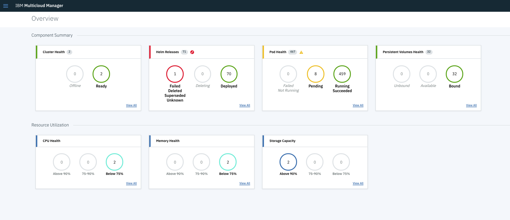
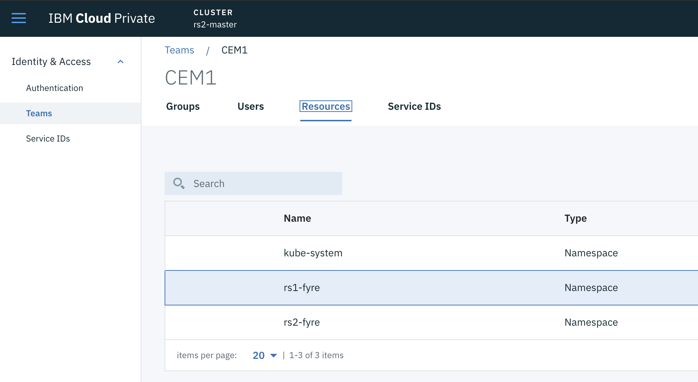
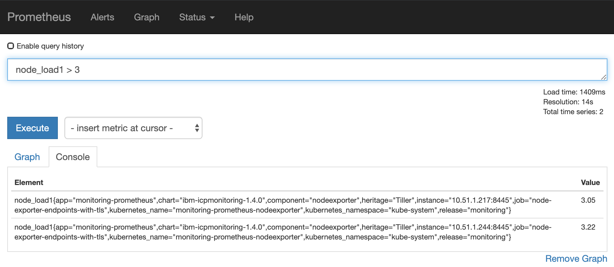

# IBM Multicloud Manager - monitoring and event management
**Author:** Rafal Szypulka (rafal.szypulka@pl.ibm.com)

This chapter is focused on monitoring and event management features delivered by IBM Multicloud Manager 3.1.2.

* [Overall MCM dashboard](#overall-mcm-dashboard)
* [MCM Application monitoring](#mcm-application-monitoring)
    + [Metrics collection and visualization](#metrics-collection-and-visualization)
* [IBM Cloud Event Management for IBM Multicloud Manager](#ibm-cloud-event-management-for-ibm-multicloud-manager)
    + [Installing the Cloud Event Management for IBM Multicloud Manager](#installing-the-cloud-event-management-for-ibm-multicloud-manager)
        - [Prerequisites](#prerequisites)
        - [Installation of the Cloud Event Management controller](#installation-of-the-cloud-event-management-controller)
        - [Installation of the Cloud Event Management for IBM Multicloud Manager](#installation-of-the-cloud-event-management-for-ibm-multicloud-manager)
    + [User management](#user-management)
    + [First logon to the CEM console](#first-logon-to-the-cem-console)
* [Conclusion](#conclusion)


## Overall MCM dashboard

IBM Multicloud Manager Overview dashboard is available from the **Overview** section in the MCM menu.



You can view details of your IBM Cloud Private clusters and other cloud service providers supported by IBM Cloud Private. You can also view details about your applications. The Overview dashboard is continuously refreshed in real time.

The following information about clusters is provided:

* Name of the cloud service with the number of clusters
* Cluster compliance
* Pod details
* Cluster status
* Cluster resources (VCPU/Memory usage)
* Storage usage

You can also view the information about each application and clusters where this application has been deployed:

* Number of clusters
* Number of Kubernetes types
* Number of regions
* Number of nodes
* Number of pods

The Overview page can be further personalized with the filtering feature. Click **Filter results** menu to specify what information is displayed on your page.

## MCM Application monitoring

### Metrics collection and visualization

To access an Application Health View Dashboard (shown below), you must first access the **Applications** page from the MCM Menu:


Next to each application, under the **DASHBOARD** column, there is a `Launch Health View` button. If you click it, you will open the Health View Grafana dashboard for that application.

A Grafana Dashboard for MCM applications is generated automatically for each deployed application and shows metrics related to resource utilization (CPU, memory, network) of the application containers and overall resource utilization of the clusters where an application has been deployed.


MCM federated Prometheus is a data source for an application monitoring dashboard. MCM Controller installation deploys a federated Prometheus instance which will pull selected metric data from the Prometheus instances located on managed ICP clusters.

The deployment name for the MCM Controller's Federated Prometheus is: `mcm-controller-ibm-mcm-prod-prometheus`

Initially, just after MCM installation, the MCM federated Prometheus instance doesn't collect any data. Its configuration is generated dynamically during application deployment via MCM. The Target ICP clusters are added to the MCM federated Prometheus instance's ConfigMap during application deployment.

The example below shows a dynamic update of the MCM federated Prometheus ConfigMap after deployment of the application to three ICP clusters:

```yaml
    scrape_configs:
    - job_name: mcm-dynamic-se-prod-312-ubuntu
      honor_labels: true
      params:
        match[]:
        - '{job="kubernetes-cadvisor"}'
      scrape_interval: 1m
      scrape_timeout: 30s
      metrics_path: /apis/mcm.ibm.com/v1alpha1/namespaces/se-prod-312-ubuntu/clusterstatuses/se-prod-312-ubuntu/monitor/federate
      scheme: https
      static_configs:
      - targets:
        - kubernetes.default:443
        labels:
          cluster_name: se-prod-312-ubuntu
      bearer_token_file: /var/run/secrets/kubernetes.io/serviceaccount/token
      tls_config:
        ca_file: /var/run/secrets/kubernetes.io/serviceaccount/ca.crt
        insecure_skip_verify: false
    - job_name: mcm-dynamic-se-stg-312-ubuntu
      honor_labels: true
      params:
        match[]:
        - '{job="kubernetes-cadvisor"}'
      scrape_interval: 1m
      scrape_timeout: 30s
      metrics_path: /apis/mcm.ibm.com/v1alpha1/namespaces/se-stg-312-ubuntu/clusterstatuses/se-stg-312-ubuntu/monitor/federate
      scheme: https
      static_configs:
      - targets:
        - kubernetes.default:443
        labels:
          cluster_name: se-stg-312-ubuntu
      bearer_token_file: /var/run/secrets/kubernetes.io/serviceaccount/token
      tls_config:
        ca_file: /var/run/secrets/kubernetes.io/serviceaccount/ca.crt
        insecure_skip_verify: false
    - job_name: mcm-dynamic-se-dev-312-ubuntu
      honor_labels: true
      params:
        match[]:
        - '{job="kubernetes-cadvisor"}'
      scrape_interval: 1m
      scrape_timeout: 30s
      metrics_path: /apis/mcm.ibm.com/v1alpha1/namespaces/se-dev-312-ubuntu/clusterstatuses/se-dev-312-ubuntu/monitor/federate
      scheme: https
      static_configs:
      - targets:
        - kubernetes.default:443
        labels:
          cluster_name: se-dev-312-ubuntu
      bearer_token_file: /var/run/secrets/kubernetes.io/serviceaccount/token
      tls_config:
        ca_file: /var/run/secrets/kubernetes.io/serviceaccount/ca.crt
        insecure_skip_verify: false
```

In the example above, the generated configuration instructs MCM federated Prometheus instance to collect cAdvisor metrics from three child ICP Prometheus instances, located respectively on three ICP clusters: `se-prod-312-ubuntu`, `se-stg-312-ubuntu` and `se-dev-312-ubuntu`.
More information about Prometheus federation mechanisms: [https://prometheus.io/docs/prometheus/latest/federation/](https://prometheus.io/docs/prometheus/latest/federation/).


## IBM Cloud Event Management for IBM Multicloud Manager

IBM Cloud Event Management (CEM) allows to set up a real-time incident management for the applications and infrastructure managed by the Multi Cloud Manager. Incidents are generated from events/alerts which indicate that something has happened on an application, service, or another monitored object.
Cloud Event Management can receive events from various monitoring sources, either on premise or in the cloud.

In the MCM environment, the CEM collects alerts from Prometheus instances located at each managed cluster. The Cloud Event Management Controller for MCM (deployed using `alerttargetcontroller` helm chart) automatically configures managed Prometheus Alertmanager instances to send alert notifications to the central CEM instance installed on MCM Controller.

### Installing the Cloud Event Management for IBM Multicloud Manager

The IBM Cloud Event Management for MCM is included inside IBM Multicloud Manager installation package. Unpack the MCM installation archive `mcm-3.1.2.tgz` and inside you will find two CEM PPA packages:

* **Could Event Management Controller** - alerttargetcontroller-ppa-0.0.2.tar.gz
* **Cloud Event Management** - cem-mcm-ppa-ibm-cem-2.2.0.tar.gz

Load both PPA packages to the local container registry on MCM hub cluster and `alerttargetcontroller` on every managed cluster.

```bash
docker login <MCM-cluster-hostname>:8500
cloudctl login -a https://<MCM-cluster-hostname>:8443 --skip-ssl-validation -n kube-system
cloudctl catalog load-archive -a <ppa-archive> --registry <MCM-cluster-hostname>:8500/kube-system
```

The following procedure describes installation and configuration steps on example ICP 3.1.2 cluster running MCM controller. The sequence of the steps is important.

#### Prerequisites
* MCM Controller and MCM Klusterlet deployed on MCM hub ICP 3.1.2 cluster and Klusterlet deployed on managed ICP clusters.
* CEM PPA packages imported as per instructions above.
* CEM users have an `Administrator` role within a Team which has a resource management assigned to a managed cluster namespaces.

#### Installation of the Cloud Event Management controller
Go to the ICP Catalog and deploy the `alerttargetcontroller` chart on both MCM hub cluster and managed clusters in the `kube-system` namespace.


`MCM Fullname Override` option can be obtained using:

```bash
kubectl get po -n kube-system | grep klusterlet
```
Copy the pod name part before the `klusterlet` word (`klusterlet-ibm-mcmk-prod` on the example below):

```bash
# kubectl get po | grep klusterlet
klusterlet-ibm-mcmk-prod-klusterlet-657958f69f-v7cw9              3/3     Running     0          30h
klusterlet-ibm-mcmk-prod-weave-scope-49sxf                        1/1     Running     0          30h
```

`ICP Cluster namespace` is the cluster namespace created during klusterlet deployment. In our case the namespace name is `mcm-se-dev-31`. It can be obtained using:

```bash
# kubectl get clusters --all-namespaces
NAMESPACE   NAME        ENDPOINTS           STATUS   AGE
se-stg-31   se-stg-31   172.16.40.68:8001   Ready    1d
se-dev-31   se-dev-31   172.16.40.98:8001   Ready    1d
```
After chart deployment, make sure the `alerttargetcontroller` pod is running.

```bash
# kubectl get pod -n kube-system|grep alerttarget
atc-alerttargetcontroller-alerttargetcontroller-77f87fb77cx6fph   1/1     Running                 1          10h
```

#### Installation of the Cloud Event Management for IBM Multicloud Manager

Deploy `ibm-cem` chart you loaded together with CEM image to `local-charts` repository in the `kube-system` namespace on the MCM hub cluster.

* **NOTE**: The CEM chart provided with ICP's built-in `ibm-charts` repository is a `Community Edition` version which is not designed to work with MCM.


In our setup we used ICP UI console hostname for both `ICP Master IP` and `Ingress Domain` options.

After deployment, wait a couple of minutes until all CEM pods are started and run the following command to configure OIDC registration with IBM Cloud Private:

```bash
kubectl exec -n kube-system -t `kubectl get pods -l release=cem -n kube-system \
| grep "cem-ibm-cem-cem-users" | grep "Running" | head -n 1 \
| awk '{print $1}'` bash -- "/etc/oidc/oidc_reg.sh" "`echo $(kubectl get secret platform-oidc-credentials -o yaml -n kube-system \
| grep OAUTH2_CLIENT_REGISTRATION_SECRET: | awk '{print $2}')`"
```

Verify the alerttargets CRD has been created:

```bash
kubectl get alerttargets --all-namespaces
NAMESPACE   NAME                  AGE
se-stg-31   se-stg-31-se-stg-31   2h
se-dev-31   se-dev-31-se-dev-31   2h
```

At this point the Alertmanager ConfigMaps for Prometheus instances are located on managed clusters: `monitoring-prometheus-alertmanager` should be automatically updated by the `alerttargetcontroller`.

To see the ConfigMap YAML for each managed cluster, run the following command on each managed cluster:

```bash
kubectl get cm monitoring-prometheus-alertmanager -n kube-system -o yaml
```

In the `route:` -> `routes:` section you should see the following:

```bash
      - receiver: cemwebhook
        group_by:
        - alertname
        - instance
        - severity
        continue: true
        group_wait: 10s
        group_interval: 10s
        repeat_interval: 1m
```

And in the `receivers:` section you should see:

```bash
    - name: cemwebhook
      webhook_configs:
      - send_resolved: true
        http_config:
          tls_config:
            insecure_skip_verify: true
        url: https://172.16.40.68:8443/norml/webhook/prometheus/cem-1/695c8db7-344c-4af7-84f3-10f99eab440a/Snfok7F3_0ndxxxxxx762ZWnsMmnPtnLG69ID_rzctg
```

Note, the CEM `url:` will be different in your environment.

The **CEM Alert Target Controller** adds a couple of sample alert definitions to the `AlertRules` CRD. This can be verified using by running the following command:

```bash
kubectl get alertrules
NAME                           ENABLED   AGE   CHART                     RELEASE      ERRORS
cem-alert-rules                true      2h
(...)
```

These alert rules can be customized based on your requirements. We recommend considering our [best practice alert definitions for ICP platform](https://github.com/ibm-cloud-architecture/CSMO-ICP/tree/master/prometheus/alerts_icp_3.1.2).

Check the Prometheus Alertmanager logs to verify that there are no errors while sending the webhook notifications to CEM.

```bash
kubectl logs <alertmanager pod> -n kube-system
```

### User management

CEM console access is managed through ICP `Teams` page in the ICP Console. To create a team with `Administrator` role, run the following steps:

* On the MCM HUB Cluster, go to **Manage -> Identity & Access**.
* Click on the **Teams** menu.
* Create a Team and call it `CEM`.
* Click the **Users** tab and assign the `Administrator` role to the users in the Team.
* Finally, click the **Resources** tab and add a row of type **Namespace** with the namespace name for each managed cluster.



### First logon to the CEM console

Cloud Event Management console can be accessed from the Multicloud Manager console. Logon to MCM UI as one of the Team members (mentioned in the [User Management](#user-management) section) and select `Event Management`.


You may be asked to authenticate again with the ICP user and you should see one or more subscriptions.


Example subscription `cem-1` on the picture above is the name of the ICP `Team` authorized to manage a cluster namespace.

Click `Launch` and then on the `Incidents` tab. If some defined Prometheus alerts are active (you can verify it via Prometheus Alertmanager UI available from the ICP console `Platform -> Alerting`), you should see those incidents in the CEM UI:


Now click on one of the incidents to see the Prometheus alert details:


Click on the `Generator URL` link to open the Prometheus UI on the managed cluster and see the current result of the PromQL query that generated this alert:



## Conclusion

**IBM Cloud Event Management** for **IBM Multicloud Manager** enables you to access Prometheus alert information for each of your managed clusters from a centralized location.

To learn more about using and operating Cloud Event Management, check out the [Cloud Event Management documentation](https://www.ibm.com/support/knowledgecenter/SSURRN/com.ibm.cem.doc/index.html).