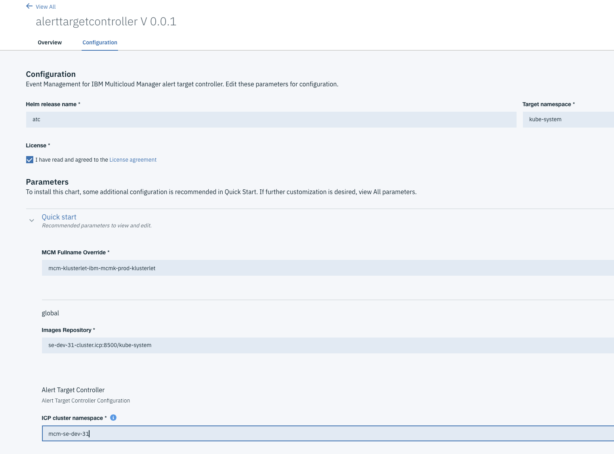
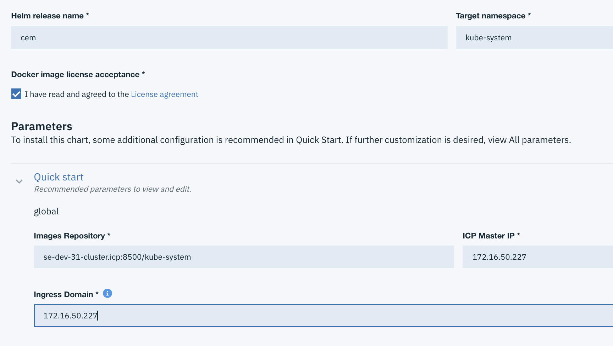
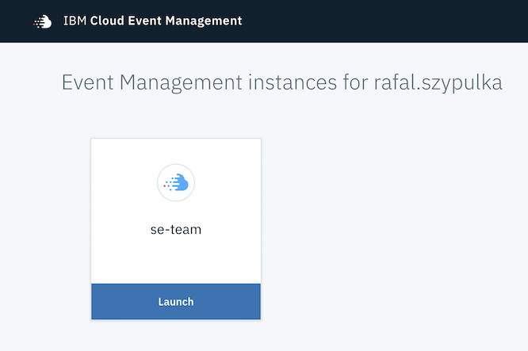

# IBM Multicloud Manager - monitoring and event management
**Author:** Rafal Szypulka (rafal.szypulka@pl.ibm.com)

This chapter is focused on monitoring and event management features delivered by IBM Multicloud Manager.


Check chapter [Day 2 operation with MCM](chapter8_day2operation.md) for broader description of Cloud Service Management and Operations aspects.


  - [Overall MCM dashboard](#overall-dashboard)
  - [MCM Application monitoring](#mcm-application-monitoring)
     - [Metrics collection and visualization](#metrics-collection-and-visualization)
  - [IBM Cloud Event Management for IBM Multicloud Manager](#ibm-cloud-event-management-for-ibm-multicloud-manager)
    - [Installing Event Management for IBM Multicloud Manager](#installing-event-management-for-ibm-multicloud-manager)
      - [Prerequisites](#prerequisites)
      - [Installation of the Cloud Event Management controller](#installation-of-the-cloud-event-management-controller)
      - [Installation of the Cloud Event Management for IBM Multicloud Manager](#installation-of-the-cloud-event-management-for-ibm-multicloud-manager)
      - [First logon to CEM console](#first-logon-to-cem-console)
      - [Cloud Event Management documentation](#cloud-event-management-documentation)


## Overall MCM dashboard

IBM Multicloud Manager Overview dashboard is available from the MCM menu: `Overview`. It shows general set of metrics collected from managed clusters:

- Cluster Health
- Helm Releases
- Pod Health
- Persistent Volume Health
- CPU Health
- Memory Health
- Storage Capacity


## MCM Application monitoring

### Metrics collection and visualization

Application dashboards are available from the MCM UI: `Applications -> Launch Health View`


A Grafana Dashboard for MCM applications is generated automatically for each deployed application and shows metrics related to resource utilization (CPU, memory, network) of the application containers and overall resource utilization of the clusters where an application has been deployed.


MCM federated Prometheus is a data source for an application monitoring dashboard. MCM Controller installation deploys a federated Prometheus instance which will pull selected metric data from the Prometheus instances located on managed ICP clusters.
Deployment name: `mcm-controller-ibm-mcm-controller-prometheus`

Initially, just after MCM installation, the MCM federated Prometheus instance doesn't collect any data. Its configuration is generated dynamically during application deployment via MCM.
Target ICP clusters are added to the MCM federated Prometheus instance ConfigMap during application deployment.

The example below, shows a dynamic update of the MCM federated Prometheus ConfigMap after deployment of the application to two ICP clusters:

```
   scrape_configs:
    - job_name: mcm-dynamic-se-prod-31
      honor_labels: true
      params:
        match[]:
        - '{job="kubernetes-cadvisor"}'
      scrape_interval: 1m
      scrape_timeout: 30s
      metrics_path: /federate
      scheme: https
      static_configs:
      - targets:
        - se-prod-31.prometheus.icp:443
        labels:
          cluster_name: se-prod-31
      tls_config:
        cert_file: /prometheus/hcm/mcm-dynamic-se-prod-31/tls.crt
        key_file: /prometheus/hcm/mcm-dynamic-se-prod-31/tls.key
        insecure_skip_verify: true
    - job_name: mcm-dynamic-se-stg
      honor_labels: true
      params:
        match[]:
        - '{job="kubernetes-cadvisor"}'
      scrape_interval: 1m
      scrape_timeout: 30s
      metrics_path: /federate
      scheme: https
      static_configs:
      - targets:
        - se-stg.prometheus.icp:443
        labels:
          cluster_name: se-stg
      tls_config:
        cert_file: /prometheus/hcm/mcm-dynamic-se-stg/tls.crt
        key_file: /prometheus/hcm/mcm-dynamic-se-stg/tls.key
        insecure_skip_verify: true
```

The additional configuration instructs MCM federated Prometheus instance to collect selected (cAdvisor) metrics from two child ICP Prometheus instances, located respectively on two ICP clusters: `se-prod-31` and `se-stg`.
More information about Prometheus federation mechanisms: [https://prometheus.io/docs/prometheus/latest/federation/](https://prometheus.io/docs/prometheus/latest/federation/).


## IBM Cloud Event Management for IBM Multicloud Manager

IBM Cloud Event Management allows to set up a real-time incident management for the applications and infrastructure managed by the Multi Cloud Manager. Incidents are generated from events/alerts which indicate that something has happened on an application, service, or another monitored object.
Cloud Event Management can receive events from various monitoring sources, either on premise or in the cloud.

In the MCM environment, the CEM collects alerts from Prometheus instances located at each managed cluster. CEM for MCM automatically configures managed Prometheus Alertmanager instances to send alert notifications to the central CEM instance installed on MCM Controller.

### Installing Event Management for IBM Multicloud Manager

You can download the IBM Cloud Event Management optional component for IBM Multicloud Manager from the IBM Passport Advantage website, then import PPA to the ICP container registry and deploy CEM charts. Install IBM Multicloud Manager on your hub-cluster and IBM Multicloud Manager Klusterlet on all clusters that you want to manage.

Use the following [instructions](https://www.ibm.com/support/knowledgecenter/SSURRN/com.ibm.cem.doc/em_obtain_mcmppa.html) to download and install Cloud Event Management.

The following procedure describe installation and configuration steps on example ICP 3.1 cluster running MCM controller. The sequence of the steps is important.

#### Prerequisites
- MCM Controller and MCM Klusterlet deployed on ICP 3.1 cluster
- CEM PPA packages imported as per [instructions](https://www.ibm.com/support/knowledgecenter/SSURRN/com.ibm.cem.doc/em_obtain_mcmppa.html).
- ICP user has a `Cluster administrator` role within a Team which has a resource management assigned to a managed cluster namespace.

#### Installation of the Cloud Event Management controller
Deploy an alerttargetcontroller chart on MCM Contoller cluster in the `kube-system` namespace.


`MCM Fullname Override` option can be obtained using:

```
kubectl get po -n kube-system|grep klusterlet
```
Copy the pod name part before the `klusterlet` word as on the picture below:


`ICP Cluster namespace` is the cluster namespace created during klusteret deployment. In our case the namespace name is `mcm-se-dev-31`. It can be obtained using:

```
kubectl get clusters --all-namespaces
NAMESPACE             NAME              AGE
mcm-se-dev-31         se-dev-31         1d
mcm-se-prod-rhel-31   se-prod-rhel-31   1d
```
After chart deployment, make sure the `alerttargetcontroller` pod is running.

#### Installation of the Cloud Event Management for IBM Multicloud Manager

Deploy `ibm-cem` chart from the local-chart repo in the `kube-system` namespace on the MCM Controller cluster.

In our setup we used ICP UI console IP address for both `ICP Master IP` and `Ingress Domain` options.

After deployment, wait a couple of minutes to start all the CEM pods and run the following command to configure OIDC registration with IBM Cloud Private:

```
kubectl exec -n kube-system -t `kubectl get pods -l release=cem -n kube-system \
| grep "cem-ibm-cem-cem-users" | grep "Running" | head -n 1 \
| awk '{print $1}'` bash -- "/etc/oidc/oidc_reg.sh" "`echo $(kubectl get secret platform-oidc-credentials -o yaml -n kube-system \
| grep OAUTH2_CLIENT_REGISTRATION_SECRET: | awk '{print $2}')`"
```
Verify the alerttarget has been created:

```
kubectl get alerttarget --all-namespaces
NAMESPACE    NAME                   AGE
mcm-se-dev   mcm-se-dev-se-dev-31   1d
```
At this point the ConfigMaps for managed Prometheus: `monitoring-prometheus-alertmanager` and `monitoring-prometheus-alertrules` should be automatically updated by the alerttargetcontroller.
Verify it using:

```
kubectl get cm monitoring-prometheus-alertmanager -n kube-system -o yaml
```

in the `route:` ->  `routes:` section you should see:

```
      - receiver: cemwebhook
        group_by:
        - alertname
        - instance
        - severity
        continue: true
        group_wait: 10s
        group_interval: 10s
        repeat_interval: 1m
```
and in the `receivers:` section you should see:

```
    - name: cemwebhook
      webhook_configs:
      - send_resolved: true
        http_config:
          tls_config:
            insecure_skip_verify: true
        url: https://172.16.50.227:8443/norml/webhook/prometheus/se-team/6196999a-6c1c-43de-9769-ef9a5c7b0bad/jWa3zrTOSS_2p0zJYmHKQA3gA5HLADu7X-FgdDt8yz4
    templates: []
```

Note, the CEM `url:` will be different in your environment.

The CEM Alert Target Controller adds a couple of sample alert definitions to the `monitoring-prometheus-alertrules`  ConfigMap. This can be verified using:

```
kubectl edit cm monitoring-prometheus-alertrules -n kube-system
```
These alert rules can be customized to the local requirements. We recommend to add [best practice alert definitions for ICP platform](https://github.com/ibm-cloud-architecture/CSMO-ICP/tree/master/prometheus/alerts_prometheus2.x).

Check the Prometheus Alertmanager logs to verify if there are no errors during sending webhook notifications to CEM.

```
kubectl logs <alertmanager pod> -n kube-system
```

#### First logon to CEM console

Cloud Event Management console can be accessed from the Multicloud Manager console. Logon to MCM UI as one of the Team (mentioned in the [prerequisites](#prerequisites) section) members and select `Event Management`.


You may be asked to authenticate again with the ICP user and you should see one or more subscriptions.



Example subscription `se-team` on the picture above is a name of the ICP team authorised to manage a cluster namespace.

Click `Launch` and if some defined Prometheus alerts are active (you can verify it in the ICP console `Platform -> Alerting`), you should see incidents in CEM UI:


#### Cloud Event Management documentation

More information about how to operate and use the Cloud Event Management: [Cloud Event Management documentation](https://www.ibm.com/support/knowledgecenter/SSURRN/com.ibm.cem.doc/index.html)