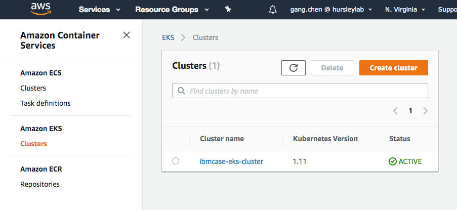
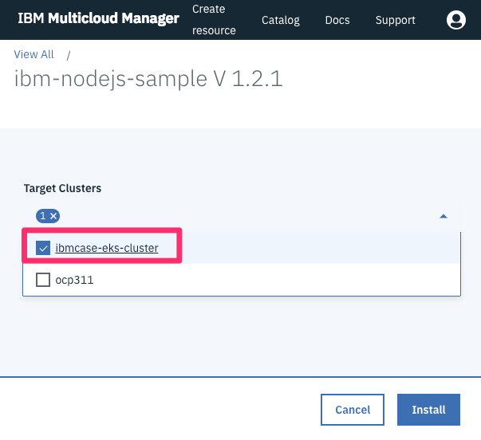
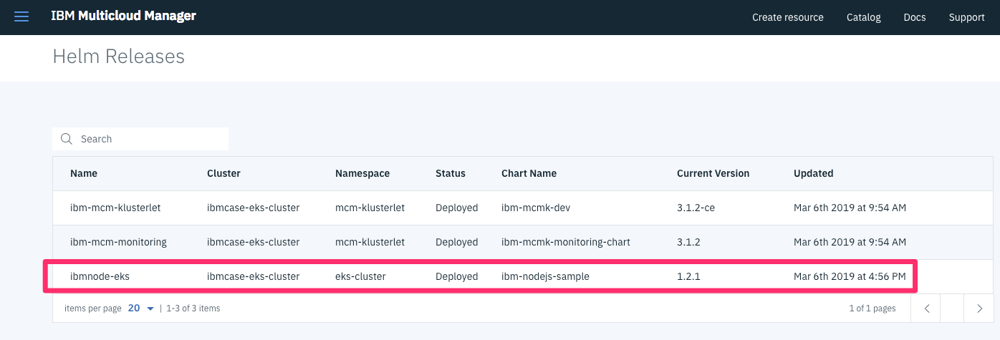

# Manage AWS EKS Clusters
Author: Gang Chen (gangchen@us.ibm.com)

This section focuses on how to manage AWS hosted Kubernetes as a Service EKS cluster through MCM.

## Architecture


To manage an Amazon Elastic Container Service for Kubernetes (EKS), you need to install IBM Multicloud Manager Klusterlet in an EKS cluster.
This guide will walk through the detail setup and configuration under this architecture or topology.


## Pre-Requisites
In order to go through this document, you are going to need the following:

  * 1 x [IBM Cloud Private](https://www.ibm.com/support/knowledgecenter/en/SSBS6K_3.1.2/kc_welcome_containers.html) cluster.
  * [IBM Multicloud Manager on ICP  (hub)](https://www.ibm.com/support/knowledgecenter/en/SSBS6K_3.1.2/mcm/installing/install.html)
  * [Kubectl](https://kubernetes.io/docs/user-guide/kubectl-overview/) (Kubernetes CLI)
    + Follow the instructions [here](https://kubernetes.io/docs/tasks/tools/install-kubectl/) to install it on your platform.
  * [MCM CLI](https://www.ibm.com/support/knowledgecenter/en/SSBS6K_3.1.2/mcm/installing/install.html#install_cli)
    + Follow the instructions [here](https://www.ibm.com/support/knowledgecenter/en/SSBS6K_3.1.1/mcm/installing/install.html#install_cli) to install it on your platform.

Essentially, you need to have MCM hub controller already installed and configured before managing EKS clusters.

## 1. Prepare EKS cluster

You need to have an EKS cluster ready. We'll cover the high level steps here rather than going in detail on how to create an EKS cluster. [Getting Started with Amazon EKS](https://docs.aws.amazon.com/eks/latest/userguide/getting-started.html#eks-launch-workers) is pretty easy to follow to get an EKS cluster.

### Create your Amazon EKS Service Role

EKS kubernetes components uses this role to get Permission in AWS environment.
For the sample configuration, I defined a role as:
   ```
   eksCaseServiceRole
   ```

### Create Cluster VPC and SecurityGroup

It is recommended that you create a unique VPC and SecurityGroup for each EKS cluster.
The getting started guide uses AWS CloudFormation to automat the VPC and SecurityGroup creation.


You'll need the VPC, Subnet and SecurityGroup information for later steps.

### Configure kubectl and AWS cli to work with EKS

In order for `kubectl` to interact with EKS, you'll need to configure the command line utilities to manage the authentication and authorization properly. Please follow this instruction to [Configure kubectl for EKS](https://docs.aws.amazon.com/eks/latest/userguide/getting-started.html#eks-configure-kubectl)

I am performing all the operation from my Mac laptop.

### Create EKS cluster

You can either create a cluster using AWS console or cli. I used console to create an cluster.
You will be using the VPC etc. information created before when going through the cluster creation wizard.

 

As this point, you are just getting an empty cluster with control plane provisioned. But you will be charged for $0.20 per hour going forward.
One suggestion is to delete the cluster when no longer using it.

You can validate your cluster by running
```
  $ kubectl get svc
```

You should see something like:
```
  NAME             TYPE        CLUSTER-IP   EXTERNAL-IP   PORT(S)   AGE
  svc/kubernetes   ClusterIP   10.100.0.1   <none>        443/TCP   1m
```

### Launch and Configure EKS Worker Nodes
In order to install MCM Klusterlet or do anything with your EKS, you need to provision Worker nodes (essentially a collection of EC2 instances) and join the existing EKS cluster.
Again, Amazon suggest to use CloudFormation to provision and join EKS worker nodes . You will need to provide the VPC, Subnet, SecurityGroup and EKS cluster name you created early in the Stack creation wizard.

Upon finishing the CloudFormation creation, you should see a stack similar as:

 

You can validate your worker nodes by running:
```
  $ kubectl get nodes
  NAME                              STATUS    ROLES     AGE       VERSION
  ip-192-168-1xx-22.ec2.internal    Ready     <none>    7h        v1.11.5
  ip-192-168-1xx-117.ec2.internal   Ready     <none>    7h        v1.11.5
```

You can deploy sample apps to validate your cluster, but it is now ready to be managed by IBM MCM.

## 2. Install MCM Klusterlet on EKS

Here is the official documentation of [Installing the IBM Multicloud Manager Klusterlet Amazon Elastic Container Service for Kubernetes](https://www.ibm.com/support/knowledgecenter/en/SSBS6K_3.1.2/mcm/installing/mcm_eks.html). It is pretty straight forward process to get it installed with the new IBM multicloud manager inception container. I suggest you to read the image information at https://hub.docker.com/r/ibmcom/mcm-inception-amd64.

### Configure installation

```
  $ docker run -v $(pwd):/data -e LICENSE=accept \
  ibmcom/mcm-inception-amd64:3.1.2-ce \
  cp -r /installer/cluster.eks /data/cluster

  $ cd cluster
```

You just need to update the `config.yaml` file to fill in the EKS cluster information:
  - aws_access_key_id
  - aws_secret_access_key
  - aws_region
  - eks-cluster
  - cluster-name
  - cluster-namespace
  - cluster-tags
  - hub-k8s-endpoint
  - hub-k8s-token

Here is the file I used:
```
## Kubernete Service Provider (DO NOT MODIFY)
kubernete_service_provider: eks

## Service Provider Specific Paramaters
aws:
  aws_access_key_id: <your_access_id>
  aws_secret_access_key: <your_secret_key>
  aws_region: us-east-1
  eks-cluster: ibmcase-eks-cluster

## Multicloud Manager Klusterlet Settings
klusterlet:
  cluster-name: ibmcase-eks-cluster
  cluster-namespace: eks-cluster
  cluster-tags:
    environment: 'Dev'
    owner: 'ibmcase'
    datacenter: 'auto-detect'
    region: 'auto-detect'
  hub-k8s-endpoint: https://mcm-mastr-xxx-xxxx-tor01.lb.bluemix.net:8001
  hub-k8s-token: xxxx
```

### Install Klusterlet - run the inception container

Kick off this command:
```
  $  docker run --net=host -t -e LICENSE=accept \
 -v "$(pwd)":/installer/cluster \
 ibmcom/mcm-inception-amd64:3.1.2-ce \
 install-mcm-klusterlet -v

```

In couple of minutes, you should see the installation completion message similar to this:
```
...
...
...
NOTES:
Thank you for installing ibm-mcmk-dev.

Your release is named ibm-mcm-klusterlet.

To learn more about the release, try:

$ helm status ibm-mcm-klusterlet
$ helm get ibm-mcm-klusterlet
stdout_lines: <omitted>

TASK [addon : include_tasks] ************************************************************************************************************************
skipping: [localhost] => (item={'key': u'ibm-mcm-klusterlet', 'value': {u'path': u'/addon/ibm-mcmk-dev-3.1.2-ce.tgz', u'namespace': u'mcm-klusterlet', u'use_custom_template': True}})  => changed=false
item:
key: ibm-mcm-klusterlet
value:
  namespace: mcm-klusterlet
  path: /addon/ibm-mcmk-dev-3.1.2-ce.tgz
  use_custom_template: true
skip_reason: Conditional result was False

PLAY RECAP ******************************************************************************************************************************************
localhost                  : ok=47   changed=28   unreachable=0    failed=0   

Playbook run took 0 days, 0 hours, 0 minutes, 50 seconds

```

Well, now your EKS cluster can be managed by IBM MCM.
You can validate the installation by running:
```
  $ kubectl get pods --all-namespaces

  NAMESPACE        NAME                                                              READY     STATUS    RESTARTS   AGE
  kube-system      aws-node-dmwhw                                                    1/1       Running   0          8h
  kube-system      aws-node-lfjxk                                                    1/1       Running   0          8h
  kube-system      coredns-7bcbfc4774-fl48s                                          1/1       Running   0          22h
  kube-system      coredns-7bcbfc4774-h22bw                                          1/1       Running   0          22h
  kube-system      kube-proxy-2gsts                                                  1/1       Running   0          8h
  kube-system      kube-proxy-gb6zz                                                  1/1       Running   0          8h
  kube-system      tiller-deploy-b7f4768d6-vp9js                                     1/1       Running   0          6h
  mcm-klusterlet   ibm-mcm-klusterlet-ibm-mcmk-dev-klusterlet-c49b87894-dgp7k        4/4       Running   0          6h
  mcm-klusterlet   ibm-mcm-klusterlet-ibm-mcmk-dev-weave-scope-app-54dd79b6fblvfx6   2/2       Running   0          6h
  mcm-klusterlet   ibm-mcm-klusterlet-ibm-mcmk-dev-weave-scope-pzw5c                 1/1       Running   0          6h
  mcm-klusterlet   ibm-mcm-klusterlet-ibm-mcmk-dev-weave-scope-rlrcl                 1/1       Running   0          6h
  mcm-klusterlet   ibm-mcm-monitoring-prometheus-6cb4d8dbdb-g4mbb                    2/2       Running   0          6h

```

Now, if you log in MCM hub console, you should see the new cluster is now managed by MCM:

 


## 3. Validate the managed EKS cluster

Let's deploy a sample application to the EKS cluster to validate.

In IBM Multicloud Manager console, click `Catalog` menu to navigate packages from catalog.
Then, search for `node`, we'll deploy the `ibm-node-sample` application as highlighted below:

 

Click `Configure` to move to Helm configuration page. Filling Helm release name and Target namespace as the EKS Klusterlet managed namespace:

 

Make sure you choose **Remote Install**, then in Target Clusters field drop down, check your target EKS cluster as deployment target.

 

Click **Install**. In MCM console Helm release page, you should see the app is deployed to EKS cluster:

 

Validate the application pods is deployed to the EKS cluster:
```
  $ kubectl get pods -n eks-cluster // replace the namespace with the one you correlated
  NAME                                               READY     STATUS    RESTARTS   AGE
  ibmnode-eks-nodejssample-nodejs-54775f7845-ngf6f   1/1       Running   0          2m


  $ kubectl get svc -n eks-cluster
  NAME                              TYPE       CLUSTER-IP       EXTERNAL-IP   PORT(S)          AGE
  ibmnode-eks-nodejssample-nodejs   NodePort   10.100.220.242   <none>        3000:32337/TCP   3m
```

You should see the nodejs pods and services are running. To see it in browser, you need to expose the service to AWS load balancer or Ingress. I'll leave that to you as homework.

Congratulations, you now have successfully integrated an EKS cluster with IBM Multicloud Manager.

## Clean the environment

It is suggested to delete the EKS cluster and worker nodes after testing completes.
Please follow this guide on how to [Delete an EKS cluster](https://docs.aws.amazon.com/eks/latest/userguide/delete-cluster.html).

Please check other cookbook chapters to interact with managed EKS cluster.
