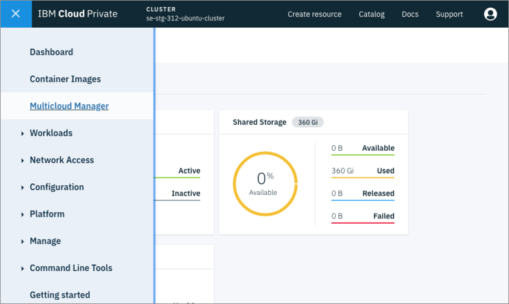
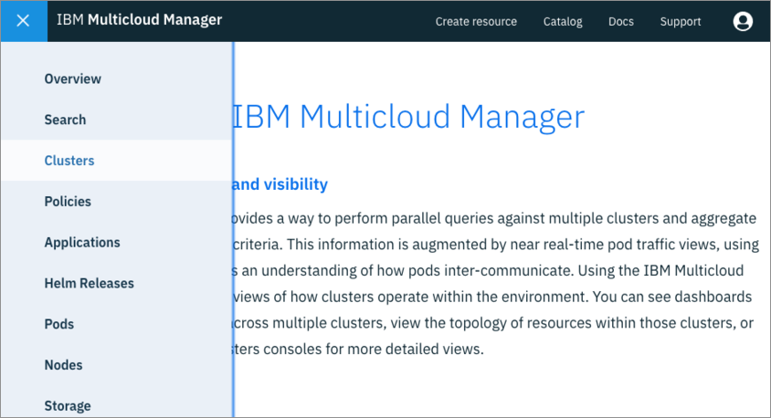

# Multicloud Manager Quick Start
In this document we will point you to the right resources to install IBM Multicloud Manager (MCM). Also, we will mention the core concepts you will need to learn to start using MCM and point you to the right resources.

## Installing MCM
The official MCM documentation has great instructions on how to install MCM Controller and MCM Klusterlet on an IBM Cloud Private cluster. You will follow those instructions with a few modifications to install MCM on two existing [IBM Cloud Private](https://www.ibm.com/support/knowledgecenter/en/SSBS6K_3.1.2/kc_welcome_containers.html) clusters. Using two clusters instead of just one is better to show the benefits of MCM.

### Cluster 1: MCM Controller and Klusterlet Cluster Preparation
The first cluster will be the `MCM Controller`, which means that this cluster will be able to manage other clusters, itself included. In order for this cluster to become the MCM Controller and manage itself, we will need to install both the `MCM Controller` and the `MCM Klusterlet` Helm Charts. The MCM Controller is in charge of monitoring and send commands to all clusters. The `MCM Klusterlet` is responsible for reporting status back to the MCM Controller and implementing its instructions.

  * Follow these [instructions](https://www.ibm.com/support/knowledgecenter/SSBS6K_3.1.2/mcm/installing/install.html) to install the MCM Controller and the MCM Klusterlet.
  * Follow these [instructions](https://www.ibm.com/support/knowledgecenter/SSBS6K_3.1.2/mcm/installing/klusterlet.html) to install the MCM Klusterlet.
  * In the Klusterlet section, for **Cluster Name** field enter `se-dev-31`.
  * Make sure to use these labels and values for this cluster:
    + **cloud**: IBM
    + **datacenter**: austin
    + **environment**: Dev
    + **owner**: case
    + **region**: US
    + **vendor**: ICP

If the above was done correctly, you have successfully setup the first cluster and can now manage it through `MCM Controller`.

### Cluster 2: MCM Klusterlet Cluster Preparation
The second cluster will only contain the `MCM Klusterlet` that reports information back to the `MCM Controller` cluster.

  * Follow these [instructions](https://www.ibm.com/support/knowledgecenter/SSBS6K_3.1.2/mcm/installing/klusterlet.html) to install the MCM Klusterlet.
  * For **Cluster Name** field, enter `se-stg-31`.
  * Make sure to use these labels and values for this cluster:
    + **cloud**: IBM
    + **datacenter**: dallas
    + **environment**: Staging
    + **owner**: case
    + **region**: US
    + **vendor**: ICP

If the above was done correctly, you have successfully setup the first cluster and can now manage it through the `MCM Controller` in the first cluster.

### Verify Clusters in the MCM Dashboard
To open the MCM Dashboard, on your MCM HUB Cluster and click the top left `Hamburger Icon -> Multicloud Manager` as shown below:

You should then be greeted by the MCM Welcome page. To open the Clusters page, click the `Hamburger Icon -> Clusters` as shown below:

If MCM Klusterlets were installed successfully, you should be able to see your clusters listed as shown below:

**NOTE**: The above is just for illustration purposes, but in your **Cluster** page, you should be able to see the `se-dev-31` and `se-stg-31` clusters. Under the **Status** column, you should see a green checkmark (✅), which indicates that the cluster is healthy and actively sending status from the Klusterlet to the MCM Controller in the HUB Cluster.

## Core Multicloud Manager Resources to Learn
Now that you have installed MCM on your IBM Cloud Private (ICP) clusters, it's time to learn how to use it! With anything Kubernetes, you will be interacting with MCM via YAML files (though MCM comes with a nice web portal that we will examine in later chapters).

As mentioned before, the official MCM documentation is a great resource to start learning about MCM in detail. However, here is a quick list with a high level summary of the concepts you will be learning throughout this entire document:

### Application
MCM has the the concept of an `Application`, which is a way to relate multiple workloads (Helm Charts) as a single unit. A cluster application is defined with the [Kubernetes SIG Application CRD](https://github.com/kubernetes-sigs/application) community specification. An `Application`, and its workloads, can be deployed into multiple ICP clusters through MCM with the help of other YAML resources that make up the application.

Here are some of the Application YAML resources you need to use in order to view and manage applications through MCM.

  * `Application` resource is used to only view your resource on the Command Line or on the MCM Dashboard.
  * `Deployable` resource deploys your Helm chart.
    + If you have multiple Helm Charts, then you will have a `Deployable` resource for each.
  * `PlacementPolicy` resource defines the criteria to find cluster(s) to place or deploy workloads.
  * `DeployableOverride` is used to define different values from the original Deployable and override a deployment.
    + This is useful if you would like to pass different configuration values for specific clusters, i.e. a different database URL.
  * `ApplicationRelationship` deploys an application on another application based on the source and destination values.
    + It is also a way to visually connect your application components and see the topology on the MCM dashboard.

To read more about the above resources, check out the [official documentation](https://www.ibm.com/support/knowledgecenter/SSBS6K_3.1.2/mcm/applications/apps_overview.html#application-resource).

### Compliance and Policy
Multicloud Manager has the ability to validate and/or enforce the existence and non-existence of Kubernetes resources with specific configurations in your clusters through `Compliance` YAML files. For example, MCM can prevent or inform you of the existence of any god-level or too powerful roles bound to a specific account in a specific namespace across multiple clusters.

As of version 3.1.2, MCM can also enforce and/or inform you of the existence and non-existence of any Kubernetes resource. This level of compliance checks makes it super simple to enforce configuration parity across multiple clusters. Also, since it's a YAML file, the compliance checks are self-documenting and can be checked into source code!

To learn more about `Compliance` resource and its features, checkout [official documentation](https://www.ibm.com/support/knowledgecenter/SSBS6K_3.1.2/mcm/compliance/policy_overview.html).