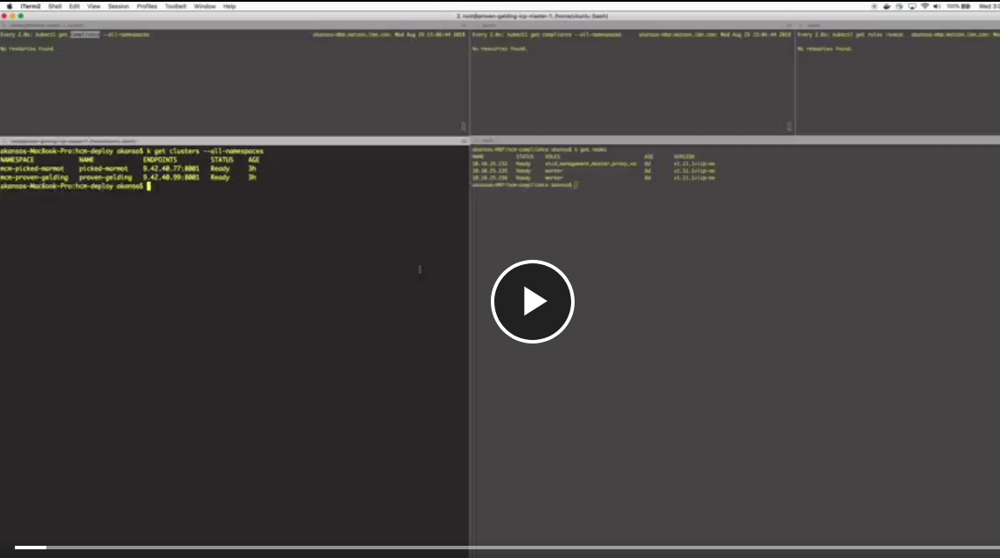

# MCM Compliance Manager
**Author:** Fabio Gomez (fabiogomez@us.ibm.com)

## Introduction
In the previous chapter we spoke of the complexities of managing applications across multiple clusters and how MCM takes that complexity away with its placement policies. We also covered a DevOps demo where you can get first hand experience on how easy it is to deploy an application to multiple clusters by leveraging MCM's placement policies.

What was not mentioned in the above scenario was that, outside of setting up MCM Hub Cluster and Klusterlets properly, to get the Guestbook app to work we had to create a [`Cluster Image Policy`](https://www.ibm.com/support/knowledgecenter/en/SSBS6K_3.1.2/manage_images/image_security.html) in both clusters to allow them to download Docker images from Docker Hub and other Docker registries. This manual step may be trivial when you have just 2 clusters. However, the more granular your configuration requirements become and the more environments/clusters you have, it gets more difficult, time-consuming, and error-prone to manage cluster configuration.

Configuration management tools, such as `Chef` & `Ansible`, have existed for a while and have become paramount for managing infrastructure configuration at scale. However, at the time of writing, there is no major configuration management solution for Kubernetes native resources such as `Deployments`, `Quotas`, `Roles`, `Role Bindings`, etc.

MCM attempts to solve this with its [`MCM Compliance Manager`](https://www.ibm.com/support/knowledgecenter/en/SSBS6K_3.1.2/mcm/compliance/compliance_intro.html) feature, which provides a desired state-based management approach for enforcing custom compliance policies (explained in later sections) on clusters that are managed by MCM. Such policies allow you to, for example, enforce the existence of any Kubernetes resource across all of your Kubernetes clusters. The `Cluster Image Policy` scenario mentioned above is a clear use case for MCM Compliance Manager. The MCM Compliance Manager policies also allow you to simply inform you of the existence or non-existence of a Kubernetes resource across your clusters without the need of enforcement, thus showing compliance status of individual clusters.

## The Basics
There are 5 concepts that you need to understand to make sense of the Compliance Manager's features. These concepts are:

* **Template**
* **Policy**
* **Compliance**
* **Placement Policy**
* **Placement Binding**

In the following sections we will be explaining the concepts above. However, for this to make sense, we will apply the concepts to a single use case with the following criteria:

* 2 **IBM Cloud Private** clusters that are managed by MCM.
* Each cluster is required to have a **Role** called `operator-role`.
* The `operator-role` **MUST** have the following access to **Pod** resources.
    + `get`
    + `list`
    + `watch`
* The `operator-role` must **NOT** have the following access to **Secrets** resources:
    + `get`
    + `list`
    + `watch`
    + `delete`
    + `create`
    + `update`
    + `patch`
* If the `operator-role` does not exist, MCM will **enforce** it into existence.
* The enforcement applies only to clusters with the following labels and values:
    + **vendor**: ICP

Now that we understand the criteria of the use case above, we can start explaining the custom resources that MCM requires to enforce it.

### Template
A Template defines a list of `policyRules` that determine whether a particular Kubernetes Resource is compliant or not. These rules are basically a list of attributes that the given Kubernetes Resource must and/or must not have in order to be compliant.

To better understand a `Template`, let's look an actual YAML file for a Template of kind `RoleTemplate`:
```yaml
apiVersion: roletemplate.mcm.ibm.com/v1alpha1
kind: RoleTemplate
metadata:
  namespace: "" # will be inferred
  name: operator-role
complianceType: "musthave" # at this level, it means the role must exist with the rules that it musthave below
rules:
  - complianceType: "mustnothave" # at this level, it means if the role exists the rule is a mustnothave
    policyRule:
      apiGroups: ["core"]
      resources: ["secrets"]
      verbs: ["get", "list", "watch","delete", "create", "update", "patch"]
  - complianceType: "musthave" # at this level, it means if the role exists the rule is a musthave
    policyRule:
      apiGroups: ["core"]
      resources: ["pods"]
      verbs: ["get", "list", "watch"]
```

Here is a breakdown of the fields above:

* **apiVersion**: The path where the custom API is defined.
* **kind**: Defines the template kind, which is `RoleTemplate` in this case.
* **metadata**:
    + **namespace**: The Kubernetes namespace for the template.
    + **name**: The name of the template.
* **complianceType**: This field determines whether the resource (`Role` in this case) that matches the given `rules` must exist or not.
    + `musthave`: Means that the resource with the matching `rules` must exist.
    + `mustnothave`: Means that the resource with the matching `rules` must NOT exist.

Note that the above fields are specific to `Template`s in general. The following fields are specific to `RoleTemplate`:

* **rules**: List of rules that will determine the compliance of a resource (`Role` in this case).
    + **complianceType**: `musthave` or `mustnothave`. Similar to a Template's higher level `complianceType`, this field determines whether the rule inside the template must exist or not.
    + **policyRule**: This is the actual compliance rule, which is defined by the fields below:
  	    - **apiGroups**: Array of API Groups to apply this rule against.
  	    - **resources**: Array of Resources from API Groups mentioned above to apply this rule against.
	      - **verbs**: Array of verbs that apply to the API Groups and Resources mentioned above.

The contents of the templates will vary based on the target Kubernetes resource. But just know that the contents of a template is what defines the rules that Compliance Manager will be checking for in order to meet compliance.

A **Template** is the most important concept to grasp correctly as everything that follows revolves around it. But don't worry, it's all downhill from here.

### Policy
Now that we understand what a `Template` is, it will be much easier to explain what a `Policy` is. A `Policy` is responsible for the following:

* Take a list of `Template`s and enforce their rules in a cluster.
* Determine which namespaces to enforce the rules into.
* Determine what remediation action to take when compliance is not met.

To better understand a `Policy`, let's look an actual YAML file for a Policy object:
```yaml
apiVersion: policy.mcm.ibm.com/v1alpha1
kind: Policy
metadata:
  name: policy-all-icp
  description: "operator-role policy"
spec:
  remediationAction: "enforce" # enforce or inform
  complianceType: "musthave" # used as default, when missing in a particular sub-template
  namespaces:
    include: ["default"]
    exclude: ["kube*"]
  role-templates:
    - apiVersion: roletemplate.mcm.ibm.com/v1alpha1
      kind: RoleTemplate
      metadata:
        namespace: "" # will be inferred
        name: operator-role
      complianceType: "musthave" # at this level, it means the role must exist with the rules that it musthave below
      rules:
        - complianceType: "mustnothave" # at this level, it means if the role exists the rule is a mustnothave
          policyRule:
            apiGroups: ["core"]
            resources: ["secrets"]
            verbs: ["get", "list", "watch","delete", "create", "update", "patch"]
        - complianceType: "musthave" # at this level, it means if the role exists the rule is a musthave
          policyRule:
            apiGroups: ["core"]
            resources: ["pods"]
            verbs: ["get", "list", "watch"]
```

Here is a breakdown of the fields above:

* **apiVersion**: The path where the custom API is defined.
* **kind**: `Policy` in this case.
* **spec**:
    + **remediationAction**: this is where you specify what you would like the Compliance Manager to do when there is a non-compliance for the given Policy. Here are the options.
    + **enforce**: If non-compliance is found, enforce policy by creating/deleting the resources in `role-templates`.
        - **inform**: If non-compliance is found, don't enforce policy but inform the MCM Admin of the non-compliance via the Dashboard.
    + **namespaces**: These are the namespaces where the policies will be enforced in.
        - **include**: Array or expression of namespaces to INCLUDE in the policy checks.
        - **exclude**: Array or expression of namespaces to EXCLUDE in the policy checks.
    + **role-templates**: List of Templates (`RoleTemplates` in this case), which contain the rules to enforce.
        - **NOTE**: You could also use `object-templates` field (not shown above) to create templates for Kubernetes resources of any kind.

Note that, we skipped `role-templates` as we already broke down and explained the contents of a Template. The only comment to add is that the templates' namespace will be inherited from the Policy's `namespaces` field.

### Compliance
We now understand that a `Template` defines the rules to enforce and a `Policy` defines how and where (namespaces) the rules are enforced in a cluster. However, a `Policy` must still be a applied to each cluster. Applying the policies manually may be fine for 1 or 2 clusters. But once again, the more abundant and more granular the policies become and the more clusters you have to manage, the more cumbersome managing the policies become.

Luckily, the Compliance Manager can manage this for you with a `Compliance` object. A `Compliance` object takes a list of `Policy` objects (and their respective `Template`s) and determines what clusters to apply them to based on cluster selectors. A `Compliance`, though not apparent by its name alone, is the final piece that ties the policies into the actual infrastructure (clusters) and, therefore, fully implement Compliance.

To better understand a `Compliance`, let's look an actual YAML file for a Compliance object, which contains 2 Policy objects:
```yaml
apiVersion: compliance.mcm.ibm.com/v1alpha1
kind: Compliance
metadata:
  name: compliance-all-icp
  namespace: mcm
  description: "operator-role compliance"
spec:
  runtime-rules:
    - apiVersion: policy.mcm.ibm.com/v1alpha1
      kind: Policy
      metadata:
        name: policy-all-icp
        description: "operator-role policy"
      spec:
        remediationAction: "enforce" # enforce or inform
        complianceType: "musthave" # used as default, when missing in a particular sub-template
        namespaces:
          include: ["default"]
          exclude: ["kube*"]
        role-templates:
          - apiVersion: roletemplate.mcm.ibm.com/v1alpha1
            kind: RoleTemplate
            metadata:
              namespace: "" # will be inferred
              name: operator-role
            complianceType: "musthave" # at this level, it means the role must exist with the rules that it musthave below
            rules:
              - complianceType: "mustnothave" # at this level, it means if the role exists the rule is a mustnothave
                policyRule:
                  apiGroups: ["core"]
                  resources: ["secrets"]
                  verbs: ["get", "list", "watch","delete", "create", "update", "patch"]
              - complianceType: "musthave" # at this level, it means if the role exists the rule is a musthave
                policyRule:
                  apiGroups: ["core"]
                  resources: ["pods"]
                  verbs: ["get", "list", "watch"]
```

The above may look overwhelming, but outside a few fields specific to the `Compliance` object, there is nothing we haven't already seen above. Here is a breakdown of the fields above:

* **apiVersion**: The path where the custom API is defined.
* **kind**: `Compliance` in this case.
* **metadata**: The common Kubernetes metadata object. There are a couple of fields that are of interest for Compliance Manager.
    + **namespace**: This is the name of the namespace that was created specifically for MCM to put Compliance objects during MCM installation.
    + **description**: Description of the Compliance object, which will be displayed in the MCM Dashboard.
* **spec**:
    + **runtime-rules**: This is a list of `Policy` objects that will be applied to the clusters based on the `PlacementPolicy` (explained in the next section).

Once again, the `Compliance` object is responsible for applying the specified `Policy` objects to the matching clusters and reporting status back to the Compliance Manager dashboard in MCM.

### Placement Policy
Now that you understand the functionality of a `Compliance` object, it's time to decide what clusters to apply this `Compliance` to. For that, we need to create the following Custom Resources:

* A `Placement Policy` resource, where, via cluster labels, you define the rules for selecting the clusters to apply the Compliance object to.
* A `Placement Binding` resource, where you bind a specific Placement Policy object to a specific Compliance object, which is the final step that tells MCM to start applying the Compliance object to the selected clusters.
  + We will go over Placement Binding in more detail in the next section.

To better understand a `PlacementPolicy`, let's look an actual YAML file for a Placement Policy object:
```yaml
apiVersion: mcm.ibm.com/v1alpha1
kind: PlacementPolicy
metadata:
  name: placement-policy-all-icp
  namespace: mcm
spec:
  clusterLabels:
    matchLabels:
      vendor: ICP
```

Here is a breakdown of the fields above:

* **apiVersion**: The path where the custom API is defined.
* **kind**: `PlacementPolicy` in this case.
* **spec**:
    + **clusterLabels**:
        - **matchLabels**: Here is where we define the labels to select the clusters where the Compliance object will be applied to. In this case we used the label `vendor` with a value of `ICP`, which means to apply the Compliance object to all ICP clusters registered with MCM Controller. You can use a combination of the following filters to select clusters:
            * **matchNames**: List of cluster names to match against.
            * **matchLabels**: List of cluster labels to match against. These are the labels which fields you for a cluster during Klusterlet installation.
            * **matchExpressions**: List of expressions to match against.
            * **matchConditions**: List of cluster conditions to match against, usually involving cluster health status.

### Placement Binding
Now that we have both a Compliance object (with all its rules and templates) and a Placement Policy object, a `Placement Binding` resource is required to bind them together and start the process of applying the Compliance policies to the clusters based on the Placement Policy criteria.

To better understand a `PlacementBinding`, let's look an actual YAML file for a Placement Binding object:

```yaml
apiVersion: mcm.ibm.com/v1alpha1
kind: PlacementBinding
metadata:
  name: placement-binding-all-icp
  namespace: mcm
placementRef:
  name: placement-policy-all-icp
subjects:
- name: compliance-all-icp
  kind: Compliance
```

Here is a breakdown of the fields above:

* **apiVersion**: The path where the custom API is defined.
* **kind**: `PlacementBinding` in this case.
* **placementRef**:
    + **name**: The name of the Placement Policy to bind.
* **subjects**: The list of objects to bind the Placement Policy with.
    + **name**: The name of the object to bind the Placement Policy with.
    + **kind**: The type of object (Compliance in our case) that it's going to be bound with the Placement Policy.

We have now introduced and explained all of the resources that are required to create and enforce Compliance Policies on Kubernetes Clusters. Now let's move on to a quick tutorial.

## Compliance Manager Tutorial
Now that we know the basic concepts and understand on a high level the components that power the Compliance Manager, let's go ahead and apply the above Compliance, Placement Policy, and Placement Binding objects to our clusters and see what that looks like on the Compliance Manager dashboard.

### Pre-requisites
This tutorial will assume you have the following pre-requisites:

* **2 IBM Cloud Private 3.1 Clusters loaded with the MCM 3.1.2 PPA loaded**
* **Cluster 1 Setup**:
    + **Install MCM Controller Chart**
        - Create a separate namespace called `mcm`, which will be used to store the `Compliance` objects.
    + **Install MCM Klusterlet Chart and enter the following values:**
        - **Name**: se-stg-31
        - **Namespace**: mcm-se-stg
        - **Labels**:
            * **cloud**: IBM
            * **datacenter**: dallas
            * **environment**: Staging
            * **owner**: case
            * **region**: US
            * **vendor**: ICP
* **Cluster 2 Setup**:
    + **Install MCM Klusterlet Chart and enter the following values:**
        - **Name**: se-dev-31
        - **Namespace**: mcm-se-dev
        - **Labels**:
            * **cloud**: IBM
            * **datacenter**: austin
            * **environment**: Dev
            * **owner**: case
            * **region**: US
            * **vendor**: ICP

### 1. Apply the Compliance
Now that we have installed MCM in both clusters, let's create the **Compliance**, **Placement Policy**, and **Placement Binding** objects located at [demos/compliance](https://github.com/ibm-cloud-architecture/kubernetes-multicloud-management/tree/master/demos/compliance). Here is a high level breakdown of the contents of the `Compliance` object:

* A **Policy** that `enforces` the creation of the policy's **RoleTemplate** if the cluster is found non-compliant.
    + This means that even if the cluster was found compliant and, for some reason, a cluster admin deletes the role, the Compliance Manager will recreate it.

Let's proceed with the `Compliance` object creation by running the following commands:
```bash
# Login against MCM Hub Cluster
cloudctl login -a https://${MCM_HUB_CLUSTER_MASTER_IP}:8443 -u ${USERNAME} -p ${PASSWORD} -n mcm --skip-ssl-validation;

# Clone the Reference Architecture Repository
git clone git@github.com:ibm-cloud-architecture/kubernetes-multicloud-management.git

# Go to the project's folder
cd kubernetes-multicloud-management

# Apply the Compliance
kubectl apply -f demos/compliance
```

Where:

* `${MCM_HUB_CLUSTER_MASTER_IP}` is the IP Address of the master node in the MCM Hub Cluster.
* `${USERNAME}` is admin user.
* `${PASSWORD}` is the admin password.
* `mcm` is the namespace in which the `Compliance` object will be created.

In the next section, we will use the MCM Compliance Manager dashboard to see the compliance results of the above `Compliance` object.

### 2. View Compliance Status on the Dashboard
To access the Policies view for the Compliance Manager, open a new browser window and go to **https://${MCM_HUB_CLUSTER_MASTER_IP}:8443/multicloud/policies**, where `${MCM_HUB_CLUSTER_MASTER_IP}` is the IP Address of the master node in the MCM Hub Cluster.

If the `Compliance` object was created successfully, you will see a screen that looks like this:


Now click on `compliance-all-icp` to see more details on the `Compliance` object. The first thing you will see are some high level details for the `Compliance`, which are similar to what we saw in the previous screenshot:


If you scroll down, you will see the `Compliance YAML Template` section that shows the actual YAML file that was used to create the Compliance, which you can also edit directly:


If you scroll further down you can see the `Compliance Status` and `Compliance Policies` sections:


Here is a breakdown of the above 2 sections:

* **Compliance Status**: The overall compliance status of an individual cluster.
    + **Cluster Name**: The name of the cluster.
    + **Policy Compliant**: Ratio of compliant policies to total number of policies.
    + **Policy Valid**: Ratio of policies with valid syntax to total number of policies.
* **Compliance Policies**: A breakdown of all the policies and their compliance status for each cluster .
    + **Compliant**: Whether the given policy is compliant.
    + **Name**: Name of the policy.
    + **Cluster Compliant**: List of compliant clusters.
    + **Cluster Not Compliant**: List of non-compliant clusters.

If you scroll further down you can see the following `Placement Policies` and `Placement Bindings` sections:


Here is a breakdown of the above 2 sections:

* **Placement Policies**: The overall compliance status of an individual cluster.
    + **Name**: The name of the Placement Policy.
    + **Namespace**: The namespace (`mcm`) in the MCM Hub cluster where this Placement Policy resource is stored.
    + **Replicas**: This is the number of application instances to be installed in the selected clusters.
        - This field is only relevant when deploying actual MCM Applications, which we explained in the [MCM Applications](mcm-applications.md) chapter.
    + **Cluster Selector**: The cluster labels that were used to select the clusters.
    + **Resource Selector**: The resource selectors (CPU, RAM, etc) that were used to select the clusters, which is none in our case.
    + **Decisions**: The clusters that MCM decided to apply the Compliance object to based on the selectors.
* **Placement Bindings**: A breakdown of all the policies and their compliance status for each cluster .
    + **Name**: The name of the Placement Binding.
    + **Namespace**: The namespace (`mcm`) in the MCM Hub cluster where this Placement Binding resource is stored.
    + **Placement Policy**: The name of the Placement Policy to be bound.
    + **Subjects**: The name of the objects (and their types) that the Placement Policy will be bound to, which is the Compliance object.

The above should give you a high level idea of the compliance status for each policy in each cluster.

### 3. View Individual Policy
The above section showed us how to get a high level compliance status for each policy on each cluster. If we want to investigate, for example, what exactly is causing a policy to show a non-compliant status, then we have to inspect the contents of the policy itself.

To view the contents of any policy, click the name of the policy in the **Compliance Policies** section shown in the last screenshot. For this example, go ahead and click on the `policy-all-icp` policy to examine its contents.


You should now be greeted with the screen above, which gives you the high level policy details that were explained in the [The Basics](#the-basics) section.

If you scroll down, you will see the **Policy YAML Template** section that shows the actual YAML file that was used to create the Policy, which you can also edit directly. In here you will also see the **Role Template**, with the API Groups and Verbs that it should and shouldn't have:


If you scroll further down, you will encounter the **Role Templates** section:


Here is a breakdown of the above section:

* **Template Details**:
	+ **Name**: Name of the template, which is `operator-role` in this case.
	+ **Compliance Type**: This field determines whether the resource (`Role` in this case) that matches the given `rules` must exist or not, which in this case must exist based on its `musthave` value.
	+ **API version**: The API version that was used to create the template.

### Conclusion
The more you use the Compliance Manager and implement `Compliance` objects into more clusters, the easier it becomes to maintain increasingly complicated configurations across multiple clusters. At this point, it is up to you to use the skills you just learned and implement Compliance policies that best suit your needs.

<!--## Short End-to-End Video Demo
If you would like to see a more involved demo or prefer a video tutorial format, then feel free to checkout this video that was put together by the MCM Compliance Manager team.
[](https://COMING_SOON)-->